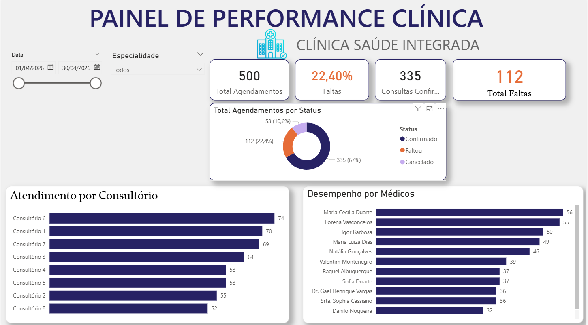

# 🏥 Dashboard de Performance Clínica & Análise de No-Show
Este projeto consiste em uma solução de ponta a ponta (**End-to-End**) que utiliza **Python** para engenharia de dados sintéticos e o **Power BI** para visualização estratégica de indicadores de saúde.

## 🚀 Objetivo
Analisar a taxa de absenteísmo (*No-Show*) de uma clínica médica fictícia, permitindo identificar gargalos por consultório, desempenho por médico e tendências temporais.

## 🛠️ Tecnologias Utilizadas
* **Python (VS Code):** Geração de dados sintéticos realistas utilizando as bibliotecas `Pandas`, `Numpy` e `Faker`.
* **Excel:** Ponte de dados entre o script e o BI.
* **Power BI:** Modelagem de dados (**Star Schema**), criação de medidas **DAX** e design de Dashboard **UX/UI**.

## 📊 Estrutura do Dashboard
* **KPIs de Topo:** Total de Agendamentos, Taxa de Faltas (%), Consultas Confirmadas e Total Absoluto de Faltas.
* **Análise por Status:** Gráfico de rosca interativo para visualização da distribuição de atendimentos.
* **Ranking de Produtividade:** Visão por médicos e consultórios para tomada de decisão operacional.

## 📈 Resultados e Insights
O painel permite ao gestor filtrar por período e especialidade, identificando instantaneamente médicos com maior taxa de cancelamento e salas com baixa ocupação, facilitando o remanejamento da grade.

---
*Projeto desenvolvido como parte do meu portfólio de Ciência de Dados.*